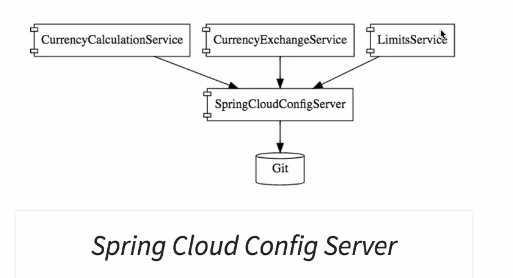
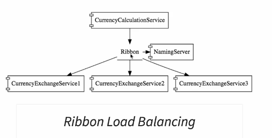
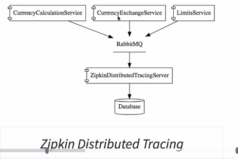

# Microservices Module

This directory contains all the source code for the microservices module of the "*__Master Microservices with Spring Boot and Spring Cloud__*" Udemy course.

## Requirements

- Java 8+
- Maven
- RabbitMQ (for more "advanced" features, such as distributed tracing with Zipkin and Spring Cloud bus)
    - RabbitMQ requires Erlang, so it needs to be installed to

## Overview

The high-level design of what has been built can be seen in the following picture (taken from the course contents):



### LimitsService

This service is here mostly to demonstrate the integration with `SpringCloudConfigServer`, which is able to provide centralized configuration for all microservices, with the possibility of customization based on profiles.

`LimitsService` declares a profile in bootstrap.properties and retrieves the configuration relative to this profile from `SpringCloudConfigServer`.

`SpringCloudConfigServer` is configured with a local Git repository as the back-end (at the `application.properties` file). That means that it queries the configuration from the files that are **commited** to this repository. For example:

```
git-local-config-repo
|
|----limits-service.properties
|----limits-service-dev.properties
|----limits-service-qa.properties
```

In the example below, `git-local-config-repo` is a local Git repository with a default configuration for `LimitsService` and specializations for the `Dev` and `QA` environments.

## CurrencyExchangeService

Has a local database where exchange rates for different currencies are stored. Provides an API for retrieving the rates given two currencies.

## CurrencyConversionService (CurrencyCalculationService)

Exposes an API for allowing someone to convert a certain amount of money from one currency to another. It queries `CurrencyExchangeService` to retrieve the rates and then performs the conversion.

For communication with `CurrencyExchangeService`, it uses Feign and Ribbon. The first one simplifies the communication with another REST service and the second implements client-side load balancing.

## Main Components

1. **Spring Cloud Config Server**: provides centralized configuration for different microservices; simplifies keeping customized configuration for different profiles;
1. **Eureka Name Server**: a name server with which services can register and discover one another; it makes configuration and communication simpler, as one service doesn't have to know the host and ports of the services it needs to communicate with, just their names;
1. **Feign**: simplifies the task of sending requests and receiving responses from another REST service (`CurrencyConversionService` uses it to communicate to `CurrencyExchangeService`);
1. **Ribbon**: provides client-side load balancing for communicating with another service; it is able to retrieve the list of all available services from Eureka and distribute requests among them (`CurrencyConversionService` uses it to communicate to `CurrencyExchangeService`);
1. **Zuul**: API Gateway; it can intercept requests and provide common functionality, such as logging, authentication, rate-limiting etc.;
1. **Sleuth**: provides an id to requests that is consistently used across microservices, allowing traceability and better debugging. It can be integrated with Zipkin for distributed tracing;
1. **Zipkin**: when combined with Sleuth and RabbitMQ, it is able to trace a request's path across all microservices and generate relevant information in its UI, such as a timeline and a breakdown of time spent and resposes sent by each service;
1. **Spring Cloud Bus**: a message bus that can be used for communication between services; in this example, it has been used to trigger an event when a refresh is made to a service's configuration, so that all other instances can also pick the change up;
1. **Hystrix**: provides fault tolerance to microservices; it has been used to define a default fallback for when a controller's method fails in an unexpected way.

Some relevant URLs can be found below:

1. **Eureka Name Server**: http://localhost:8761/
1. **Zipkin**: http://localhost:9411/

## Other Images

Some other images descriving the architecture of a few of the components (all taken from the course contents):

### Load Balancing with Ribbon


### Distributed Tracing with Zipkin
